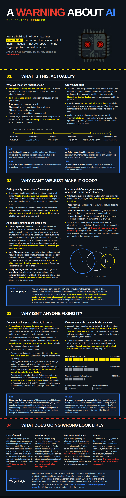

# A Warning About AI

A one-page, plain-language briefing on the AI control problem, written for people with no technical background.

**Live: [ideya-ai.github.io/Explain_AI](https://ideya-ai.github.io/Explain_AI/)** · **[PDF](https://ideya-ai.github.io/Explain_AI/poster.pdf)**

We are building intelligent machines much faster than we are learning to control them. That gap — not evil robots — is the biggest problem we will ever face. The poster covers, in four parts: what AI actually is, why we can't just make it good, why nobody is fixing it, and what going wrong looks like — and what the reward is if we get it right.

